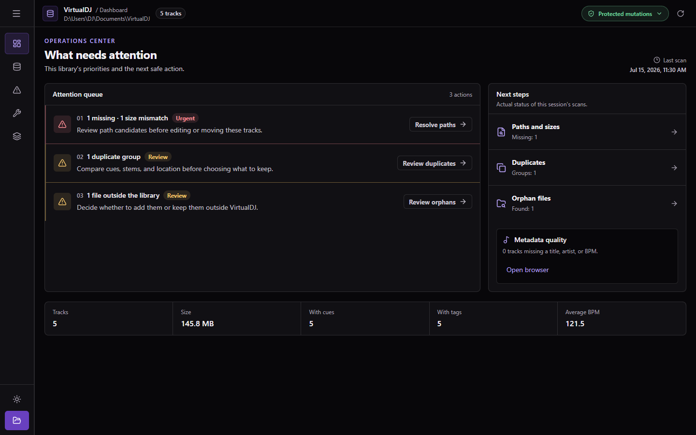
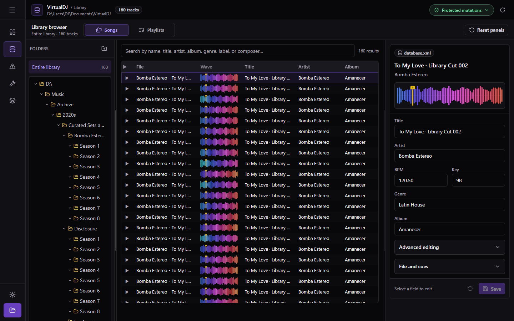
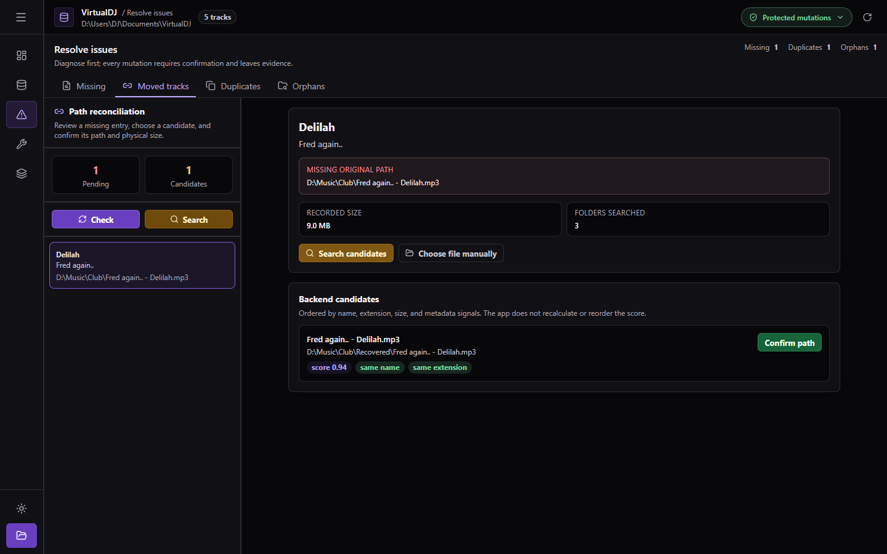
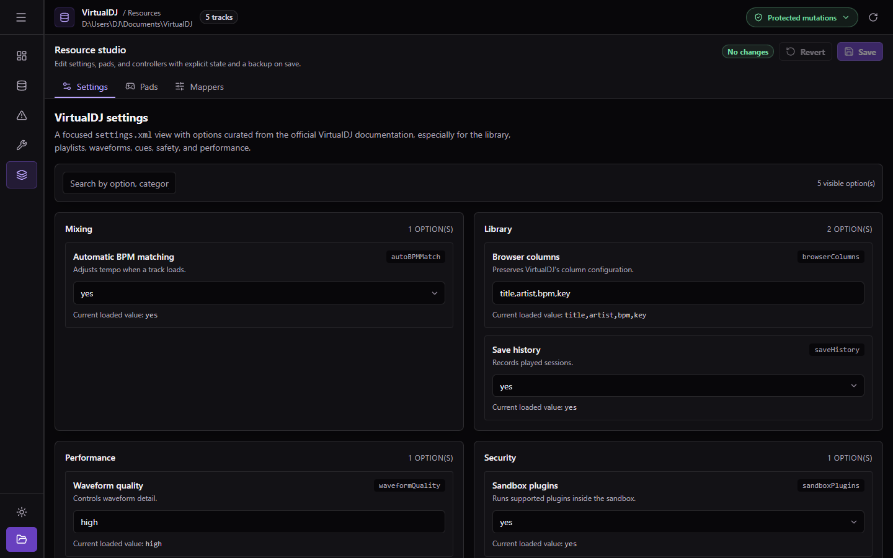

<p align="center">
  <picture>
    <source media="(prefers-color-scheme: dark)" srcset="https://shieldcn.dev/header/waveform.svg?title=VDJ+Manager&subtitle=Inspect%2C+repair%2C+and+maintain+VirtualDJ+libraries+with+safe+write+contracts&logo=tauri&theme=violet&align=center&mode=dark" />
    
  </picture>
</p>

<p align="center">
  <a href="https://github.com/gvastethecreator/vdj-manager/actions/workflows/ci.yml"></a>
  <a href="https://github.com/gvastethecreator/vdj-manager/stargazers"></a>
  <a href="https://github.com/gvastethecreator/vdj-manager/commits/main"></a>
  <a href="https://gvastethecreator.github.io/vdj-manager/"></a>
  
</p>

<p align="center">
  A safety-first desktop workspace for exploring, verifying, and maintaining VirtualDJ 8+ libraries.
  <br />
  <a href="https://gvastethecreator.github.io/vdj-manager/"><strong>Explore the in-memory web demo</strong></a>
</p>

## Product tour

| Prioritized dashboard                                                                                                           | Dense library browser                                                                                                      |
| ------------------------------------------------------------------------------------------------------------------------------- | -------------------------------------------------------------------------------------------------------------------------- |
|  |  |
| **Path reconciliation**                                                                                                         | **Resource studio**                                                                                                        |
|  |  |

## What it does

- Prioritizes broken references, pending recovery, and checks that have not run.
- Browses songs, playlists, history, metadata, cues, and waveforms in a unified workspace.
- Finds missing files, moved tracks, duplicates, and unindexed files.
- Previews rename, move, and batch tag operations before execution.
- Edits VirtualDJ settings, pads, and mappers with dirty/save/revert protection.
- Protects mutations with backups, validation, optimistic concurrency, atomic commits, no-clobber operations, a per-library journal, and explicit recovery.
- Provides a deterministic web demo that stays entirely in memory and never accesses local files.

The native application supports Windows at a minimum window size of 1180×720. The Pages demo is a safe product tour, not a replacement for native filesystem features.

## Quick start

Install Bun 1.x, Rust with the MSVC toolchain, and the [Tauri Windows prerequisites](https://v2.tauri.app/start/prerequisites/).

```powershell
bun install
bun run tauri dev
```

For frontend-only work:

```powershell
bun run dev
```

Open a deterministic state with a URL such as:

```text
http://127.0.0.1:3000/?demo&page=dashboard&state=problem
http://127.0.0.1:3000/?demo&page=songs&state=dense
http://127.0.0.1:3000/?demo&page=dashboard&recovery=manual
```

## Commands

| Command | Purpose |
| --- | --- |
| `bun run dev` | Start the Vite development server. |
| `bun run tauri dev` | Start the native desktop application. |
| `bun run check` | Run TypeScript checks and non-mutating lint. |
| `bun test` | Run DOM and unit tests with Bun and Happy DOM. |
| `bun run build` | Build the production frontend. |
| `bun run build:pages` | Build the in-memory demo for `/vdj-manager/`. |
| `bun run verify` | Run frontend checks, tests, and build. |
| `bun run deps:check` | Report outdated frontend dependencies. |
| `bun run audit` | Audit frontend dependencies. |
| `cargo test --manifest-path src-tauri/Cargo.toml` | Run the Rust test suite. |
| `cargo clippy --manifest-path src-tauri/Cargo.toml --all-targets --all-features -- -D warnings` | Enforce the Rust lint gate. |

Bun is part of the project contract: tests import `bun:test`, and Tauri invokes Bun from its development and build hooks.

## Architecture

```text
src/
├── App.tsx                    root state, navigation, errors, and caches
├── components/
│   ├── Dialog.tsx             accessible dialog and confirmation behavior
│   ├── Layout.tsx             navigation rail, header, and scoped feedback
│   ├── IntegrityWorkspace.tsx shared diagnosis shell
│   ├── ResourceStudio.tsx     settings, pads, and mappers shell
│   └── SongTable.tsx          virtualized table and inline editing
├── pages/                     task-focused product surfaces
├── lib/
│   ├── navigation.ts          navigation state and demo aliases
│   ├── runtimeServices.ts     native and in-memory adapters
│   ├── paneLayout.ts          persisted panel sizing and clamping
│   └── uiError.ts             scoped user-facing errors
└── types/database.ts          shared TypeScript contracts

src-tauri/src/
├── commands/                  typed IPC handlers
├── database/                  XML model, parser, and patch writers
└── mutation_journal.rs        journal, lease, and recovery state machine
```

## Write safety

- The frontend never serializes the complete `database.xml` document.
- Tags, relink, rename, move, and removal identify entries by `originalFilePath`.
- Writers create a backup, validate XML, detect concurrent changes, and commit atomically.
- Rename and move never overwrite a destination and use a journal for recovery.
- Cross-drive moves use journaled copy/delete steps and stop for manual review when uncertain.
- Editable VirtualDJ resources are backed up before writing.
- Mutation tests use fixtures and temporary directories, never a real music library.

## Documentation

- [Architecture](docs/architecture.md)
- [View contracts](docs/ui/view-contracts.md)
- [Implementation status](docs/implementation-status.md)
- [Technical debt](docs/tech-debt.md)
- [GitHub Pages deployment](docs/deployment.md)
- [Contributing](CONTRIBUTING.md)
- [Security policy](SECURITY.md)

## Support

Support continued development through [GitHub Sponsors](https://github.com/sponsors/gvastethecreator) or [Ko-fi](https://ko-fi.com/gvaste).

## License

No license has been published for this repository. All rights are reserved unless the repository owner states otherwise.
